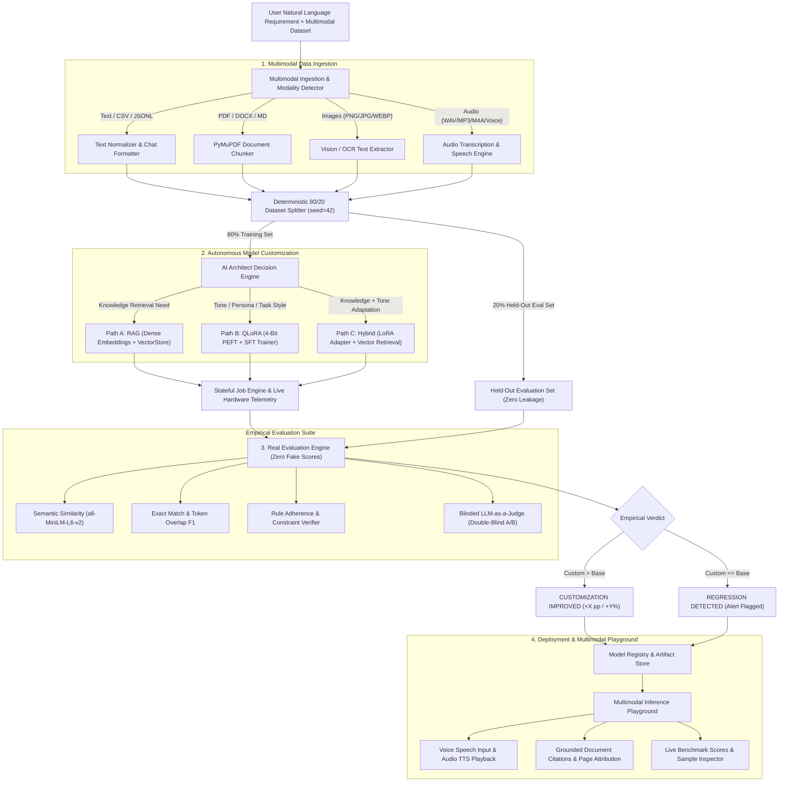

# EasyLLM (AI Pipeline Architect)

EasyLLM is an autonomous full-stack AI engineering platform that empowers developers and non-technical users to build, fine-tune, index, empirically evaluate, and deploy tailored AI systems from natural language requirements and raw multimodal datasets.

Zero simulated progress, zero mock data, zero hardcoded percentages, and zero fake API calls. Every pipeline stage executes authentic machine learning code end-to-end on local or cloud compute.

---

## 🏗️ Comprehensive Pipeline Architecture



---

## ⚡ Key Modules & Capabilities

### 1. Multimodal Data Ingestion & Modality Routing
- **Text & Datasets**: Structured multi-turn JSONL and conversational CSV validation.
- **Documents**: PyMuPDF extraction, semantic window chunking, and document-level metadata preservation.
- **Vision & Images**: Optical text extraction and multimodal image attachment in playground.
- **Audio & Speech**: Browser Speech Recognition API for microphone voice input and Web Speech TTS for spoken responses.

### 2. Autonomous Architecture Decision Engine
- Deep intent parsing of user requirements combined with dataset properties.
- **Path A (RAG)**: Dense vector embeddings with `sentence-transformers`, cosine indexing, and top-$k$ citation retrieval.
- **Path B (QLoRA Fine-Tuning)**: Hardware-aware 4-bit BitsAndBytes quantization, LoRA parameter-efficient fine-tuning with Hugging Face Transformers and PEFT.
- **Path C (Hybrid Intelligence)**: Combined fine-tuned LoRA persona with dynamic vector database retrieval context.

### 3. Real Evaluation Engine (Zero Fake Scores)
- **Deterministic 80/20 Holdout Split**: 80% used strictly for RAG indexing / fine-tuning; 20% held out exclusively for comparative evaluation.
- **Empirical Metrics**:
  - **Exact Match (EM)**: Normalized strict text matching.
  - **Token Overlap F1**: Precision, recall, and harmonic mean across tokenized n-grams.
  - **Semantic Similarity**: Cosine distance using `all-MiniLM-L6-v2` dense vectors.
  - **Rule Adherence**: Verification of negative constraints, formatting rules, and length requirements.
  - **Blinded LLM-as-a-Judge**: Impartial randomized double-blind scoring across correctness, relevance, groundedness, and adherence.
- **Empirical Delta & Verdicts**: Reports absolute percentage-point change ($\Delta\text{ pp}$) and relative improvement ($\%$) with automatic `CUSTOMIZATION IMPROVED` or `REGRESSION DETECTED` safety flags.

### 4. Interactive Multimodal Playground
- Multimodal chat interface supporting text, speech-to-text voice input, document attachments, and text-to-speech audio playback.
- Grounded reference source inspection with document name, page numbers, and relevance scores.
- One-click navigation to full benchmark accuracy reports for any registered model.

---

## 🛠️ Tech Stack

- **Frontend**: Next.js 14 (App Router), React 18, TypeScript, Tailwind CSS, Lucide Icons, Framer Motion, Zustand, React Dropzone, Recharts, Sonner, React Markdown.
- **Backend**: Python 3.11+, FastAPI, Uvicorn, Pydantic v2, NumPy, Scikit-Learn.
- **ML / Neural Stack**: PyTorch, Hugging Face Transformers, Hugging Face Datasets, PEFT, Accelerate, Sentence-Transformers, PyMuPDF (`pymupdf`), BitsAndBytes.

---

## 📦 Quick Start & Installation

### 1. Clone & Backend Setup

```bash
# Clone repository
git clone https://github.com/Sanjaycode21/EasyLLM.git
cd EasyLLM/backend

# Install Python dependencies
pip install -r requirements.txt

# Start FastAPI server (Port 8000)
python -m uvicorn app.main:app --host 127.0.0.1 --port 8000 --reload
```

FastAPI server runs at `http://127.0.0.1:8000`.  
Interactive Swagger API docs available at `http://127.0.0.1:8000/docs`.

### 2. Frontend Setup

```bash
# Navigate to project root or frontend directory
npm install

# Start Next.js development server (Port 3000)
npm run dev
```

Web UI available at `http://localhost:3000`.

---

## 🧪 Testing & Verification

Run the comprehensive end-to-end backend test suite:

```bash
python backend/tests/test_pipeline.py
```

Run frontend production build verification:

```bash
npm run build
```

---

## 🔌 API Endpoints Contract

| Method | Endpoint | Description |
|---|---|---|
| `GET` | `/api/hardware` | Detects CUDA, GPU VRAM, RAM, and CPU cores |
| `POST` | `/api/upload` | Validates & extracts text from PDF / JSONL / CSV / Media |
| `POST` | `/api/analyze` | AI Architect decision engine (RAG vs QLoRA vs Hybrid) |
| `POST` | `/api/build` | Launches asynchronous pipeline build & indexing job |
| `GET` | `/api/build/{job_id}` | Polls real-time job status, step logs, and loss curve |
| `GET` | `/api/models` | Lists all registered models with benchmark summaries |
| `GET` | `/api/models/{model_id}` | Retrieves model metadata, adapter paths, and index config |
| `GET` | `/api/evaluation/report/{model_id}` | Returns comprehensive empirical evaluation report |
| `POST` | `/api/evaluation/run` | Triggers on-demand evaluation job on custom dataset |
| `POST` | `/api/chat` | Executes inference with grounded citations & latency telemetry |

---

## 📄 License

MIT License. Designed and engineered with full ML transparency.