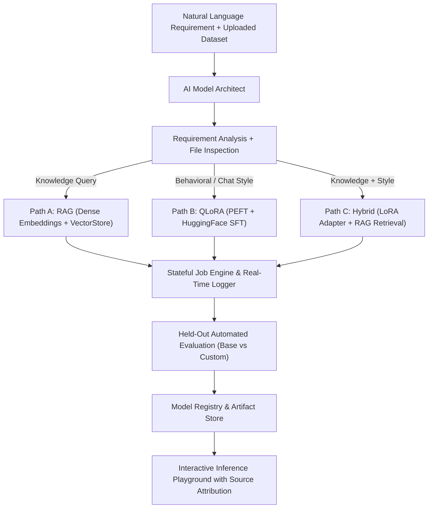

# EasyLLM

EasyLLM is an autonomous full-stack platform that enables non-technical users to build, fine-tune, index, evaluate, and deploy tailored AI systems from plain-English descriptions and raw datasets.

Zero simulated progress, zero mock data, and zero fake API calls. Every pipeline stage executes authentic ML code end-to-end.

---

## 🚀 Core Architecture Paths



1. **PATH A: RAG (Retrieval-Augmented Generation)**
   - PyMuPDF real document extraction & chunking.
   - Dense embeddings with `sentence-transformers` (`all-MiniLM-L6-v2`).
   - Vector Store with cosine similarity ranking and source chunk attribution.
2. **PATH B: QLoRA Parameter-Efficient Fine-Tuning**
   - Multi-turn conversational JSONL / CSV validation.
   - Hardware diagnostics (CUDA, VRAM, RAM, CPU).
   - PyTorch + Hugging Face Transformers + PEFT LoRA adapter training.
   - Step-by-step loss tracking and weight serialization.
3. **PATH C: Hybrid Intelligence**
   - Combines trained LoRA adapter persona with real-time RAG knowledge vector store.

---

## 🛠️ Tech Stack

- **Frontend**: Next.js 14 (App Router), React, TypeScript, Tailwind CSS, Lucide Icons, Framer Motion, Zustand, React Dropzone, Recharts, Sonner, React Markdown.
- **Backend**: Python 3.11+, FastAPI, Uvicorn, Pydantic v2.
- **ML / Neural Libraries**: PyTorch, Hugging Face Transformers, Hugging Face Datasets, PEFT, Accelerate, Sentence-Transformers, PyMuPDF (`pymupdf`), Scikit-Learn.

---

## 📦 Quick Start & Installation

### 1. Backend Setup

```bash
# Navigate to backend and install requirements
cd backend
pip install -r requirements.txt

# Start FastAPI server
python run.py
```

FastAPI server runs at `http://localhost:8000`.
Interactive Swagger API docs available at `http://localhost:8000/docs`.

### 2. Frontend Setup

```bash
# Navigate to frontend and install dependencies
cd frontend
npm install

# Start Next.js development server
npm run dev
```

Web UI available at `http://localhost:3000`.

---

## 🧪 Verification & Acceptance Tests

Run the end-to-end backend test suite:

```bash
python backend/tests/test_pipeline.py
```

Run the production frontend build:

```bash
cd frontend
npm run build
```

---

## 🔌 API Endpoints Contract

| Method | Endpoint | Description |
|---|---|---|
| `GET` | `/api/hardware` | Detects CUDA, VRAM, and CPU resources |
| `POST` | `/api/upload` | Validates & analyzes PDF / JSONL / CSV files |
| `POST` | `/api/analyze` | AI Architect decision engine (RAG vs QLoRA vs Hybrid) |
| `POST` | `/api/build` | Launches asynchronous pipeline build job |
| `GET` | `/api/build/{job_id}` | Polls real-time job status, step logs, and loss curve |
| `GET` | `/api/models` | Lists all registered AI models & adapters |
| `GET` | `/api/models/{model_id}` | Retrieves model metadata and adapter paths |
| `GET` | `/api/evaluation/{model_id}`| Returns base vs customized model benchmarks |
| `POST` | `/api/chat` | Executes inference with grounded citations & latency |