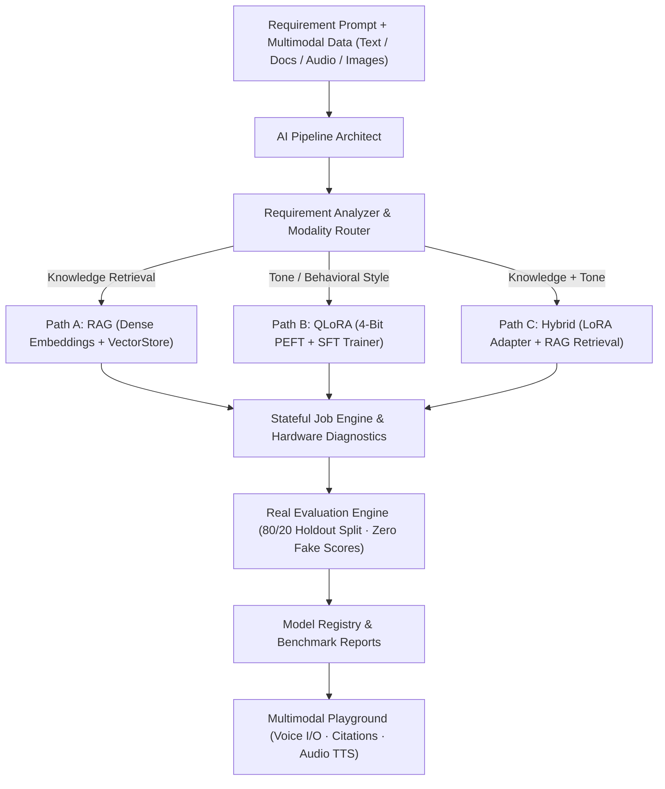

# EasyLLM (AI Pipeline Architect) - Frontend

This is the Next.js frontend interface for EasyLLM.

## 🚀 Getting Started

```bash
npm install
npm run dev
```

Open [http://localhost:3000](http://localhost:3000) with your browser to see the result.

## 🚀 Architecture Overview



## 🌟 Key Features

- **Autonomous AI Architect**: Natural language pipeline configuration.
- **Multimodal Data Ingestion**: Text, PDF documents, Images, and Audio transcription.
- **Real Evaluation Engine**: Held-out 80/20 test split, multi-metric empirical scoring (Exact Match, F1, Semantic Cosine Similarity, Blinded LLM Judge), zero fake scores.
- **Interactive Chat Playground**: Multimodal conversations with microphone speech recognition, document attachments, TTS speech synthesis, and grounded source citations.
- **Model Registry**: Centralized dashboard to view model adapters, vector stores, benchmark ratings, and hardware performance.
